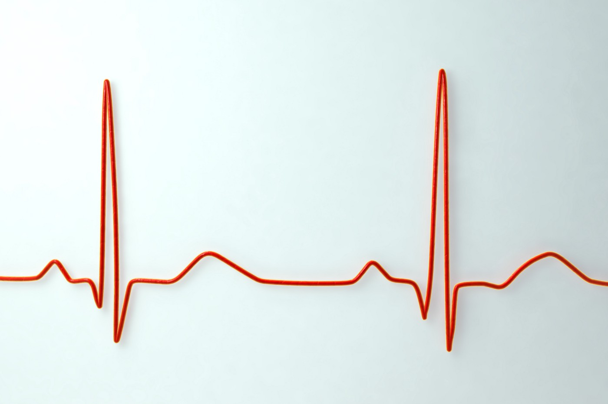

___
# Health Watch with Emergency Detection
___

# Background

- 524 deaths per 100 000 in Sri Lanka, due to CVDs

- Road Traffic Accidents Deaths in Sri Lanka reached 4,200 in 2019 (3.62% of total deaths)

- Globally, approximately 275,000 patients die each year due to medication non-adherence

- Thousands of people die because of lack of enough medical attention in emergencies as well as in long term diseases

There is a huge increase in the number of people who are getting cardiovascular diseases and sometimes they pass away suddenly and sometimes there is still time to save them if the right medication is given as soon as possible. It is always about the time. Also, even after a surgery there are occasions where things get complicated and regular monitoring is essential.

And not only the sudden accidents that are occuring due to the cardiovascular diseases but day to day activities can be a cause to an accident. Therefore in order to make sure the elderly people’s health and to take care of them by giving proper attention is really required.

Now there is no specific range of age to get sick and to face accidents we all need to look after ourselves. Therefore, it is good to keep track of our heart rate in order to make sure whether we are in good condition or not.There should be a method which does not cost more money or time to keep track of our health without being limited to an age or any specific diseases.

___
# _What to know about your heart rate_

The normal Resting Heart Rate for a adult ranges from **60 to 100 beats per minute**. If you are not like an athlete your resting heart rate must be above 60. For trained athletes(physically fit) it is possible to have resting heart rate like 40. Other than that if someone has a resting heart rate below 60 which is called **bradycardia** and has a higher heart rate than 100 is called **tachycardia** they must consult their doctor since this can be an indication of an underlying problem.

There are several facts that are going to affect to the heart rate of a person:

- Age
- Fitness and activeness
- Addicted to smoking
- Having cardiovascular diseases, high cholesterol and diabetes
- Emotions (stress level)
- Different medications

### Higher Heart Rate
Normally higher rate occurs when people are exercising and nervous as well. But many studies have confirmed that when the heart rate of a person is higher then the risk of having heart diseases is high. Also, certain medications, low levels of potassium in the blood and overactive thyroid gland can cause this too.

### Normal Heart Rate
When a person is fit physically it is obvious that he has a normal heart rate and after working out their heart rate comes to the lower level(to normal from higher) with minimum time than the others. 

### Slower Heart Rate
This can happen due to being physically fit as above mentioned. Also, this can cause by a medication or sleep patterns. But this can be some indication for diseases like heart diseases, some infections, higher level potassium in blood or conditions in thyroid gland like under activeness.

When you can keep track of heart rate you can get a better idea about your fitness, heart health and emotional health as well.

----------------------------------------------------------------------------------------------------------------------------------------------------------

# _What is blood oxygen level_

The blood oxygen level is the parameter of how much oxygen is carrying by the red blood cells. Mostly it is not necessary to measure this value in children and even in adults. This is only monitored when someone is showing symptoms like shortness in breath and chest pain. Specially for people with chronic health complications like heart diseases, monitoring oxygen level in blood can be really beneficial in case of understanding how the treatments are working and required changes in the medications.

